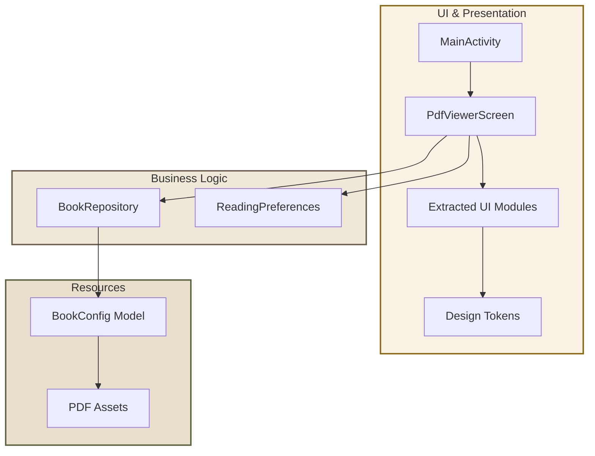
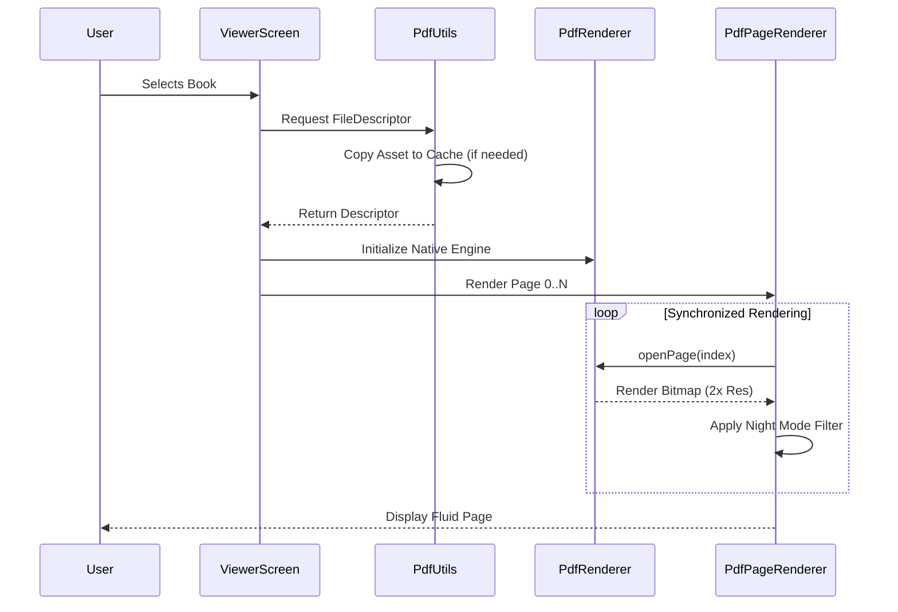
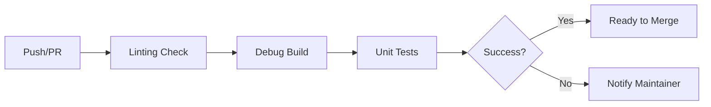

<div align="center">

# 📜 Parchment

### A Soulful PDF Reading Experience for Android

[](https://github.com/AhmadHassan-BTed/PDF-Reader/actions/workflows/ci.yml)
[](LICENSE)
[](https://developer.android.com)
[](https://kotlinlang.org)
[-8B6914>)](https://github.com/AhmadHassan-BTed)

---

**Reading is a sacred act of connection.**  
Parchment was engineered to remove the digital friction between the reader and the text.  
It brings the warmth of physical paper to the precision of modern Android engineering.

[Explore Architecture](#-architecture-overview) • [View Roadmap](ROADMAP.md) • [Contribute](CONTRIBUTING.md)

</div>

---

## 📖 The Vision

Digital PDF readers often feel cold and industrial. **Parchment**, envisioned and engineered by **Ahmad Hassan (B-Ted)**, prioritizes the human element. By utilizing a "Warm Paper" design system and a gesture-driven interface, it replicates the focused, undistracted environment of a physical library.

---

## 🛠️ Feature Ecosystem

| Feature              | Technical Implementation                  | Human Value                                |
| :------------------- | :---------------------------------------- | :----------------------------------------- |
| **Warm Aesthetic**   | Custom HSL-tailored Design System         | Reduces digital eye strain                 |
| **Parchment Engine** | Android `PdfRenderer` + 2× Super-sampling | Keeps text crisp at any zoom level         |
| **Bilingual TOC**    | Multi-script `TocItem` Model              | Seamless support for English & Urdu/Arabic |
| **Smart HUD**        | Auto-hiding gesture-aware UI              | Maximum immersion, zero clutter            |
| **Fluid Navigation** | `LazyColumn` + Haptic Feedback loops      | Tactile sense of progress                  |
| **Persistence**      | Synchronized `SharedPreferences` layer    | Never lose your place in a text            |

---

## 🏛️ Architecture Overview

The system is built on a strict **Modular Layered Architecture**. This ensures 100% cohesion and zero coupling between the rendering engine and the data source.



---

## 🔄 Request & Data Flow

When a reader opens a book, the following lifecycle is executed to ensure a sub-100ms "Time to First Page."

### Page Rendering Lifecycle



---

## 📂 Repository Structure

The project is structured to favor **feature-first discovery**. Contributors can locate logic within seconds.

```text
root/
├── .github/                # CI/CD Workflows & Templates
├── app/
│   ├── src/
│   │   ├── main/
│   │   │   ├── assets/     # Bundled PDF documents
│   │   │   └── java/ted/parchment/reader/
│   │   │       ├── data/   # Models, Prefs, Repositories
│   │   │       ├── ui/     # Themed screens & components
│   │   │       └── utils/  # Hardware/File IO Utilities
│   └── build.gradle.kts    # Modular build config
├── docs/                   # Architectural deep-dives
└── README.md               # You are here
```

---

## ⚙️ Technical Pipeline

### Build & Deployment

The project utilizes a professional GitHub Actions pipeline for every commit to ensure structural integrity.



---

## 🤝 Development Workflow

New contributions are welcomed. The repository is maintained with a high bar for engineering standards.

<details>
<summary><b>1. Development Setup</b></summary>

- **IDE:** Android Studio Ladybug+
- **JDK:** 17
- **SDK:** 36 (target), 28 (min)
- **Commands:**
    ```bash
    ./gradlew assembleDebug  # Build
    ./gradlew test           # Verify
    ```
    </details>

<details>
<summary><b>2. Module Relationship Guide</b></summary>

| Module            | Responsibility                                 |
| :---------------- | :--------------------------------------------- |
| `PdfViewerScreen` | Orchestrates navigation and HUD states         |
| `VerticalZoomBar` | Custom Canvas-based scaling controller         |
| `PdfPageRenderer` | Native-to-Bitmap bridge with memory management |
| `BookRepository`  | Single source of truth for all book metadata   |

</details>

---

## 📜 Acknowledgments & Ethics

**Parchment** is an original work by **Ahmad Hassan (B-Ted)**.  
It is built with a commitment to privacy:

- **Zero Network Calls:** Your reading habits stay on your device.
- **Zero Analytics:** No tracking, no telemetry.
- **Open Source:** Licensed under Apache 2.0.

---

<div align="center">

**Built for the love of reading.**  
Engineered by **[Ahmad Hassan (B-Ted)](https://github.com/AhmadHassan-BTed)**

</div>
